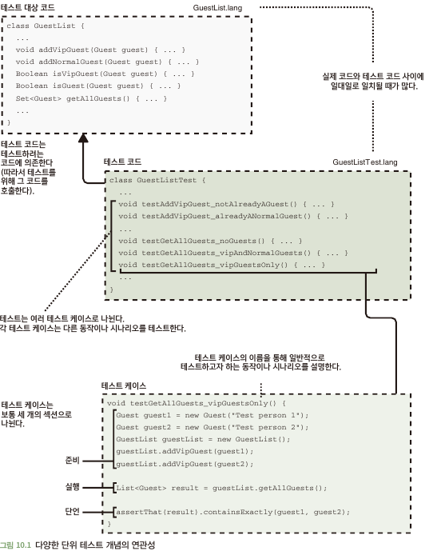

# 10.1 단위 테스트 기초
- 단위 테스트 중요 개념 및 용어
  - 테스트 중인 코드: 실제 소스 코드 (ex: Service.java)
  - 테스트 코드: 단위 테스트를 구성하는 코드 (ex: ServiceTest.java)
  - 테스트 케이스: 테스트 코드의 여러 테스트 케이스에 대한 특정 동작 및 시나리오 (ex: ServiceTest.java 내 logicTest 함수)
    - 준비: 테스트 동작 전 선행 작업 -> 의존성 설정, 테스트 값 정의 등
    - 실행: 동작 실제 호출 코드
    - 단언: 실제로 올바른 일이 발생했는지 확인
- '실제 코드'가 보여주는 모든 동작에는 테스트 케이스 존재 -> 이상적이면서 그렇게 되게 노력 필요\

