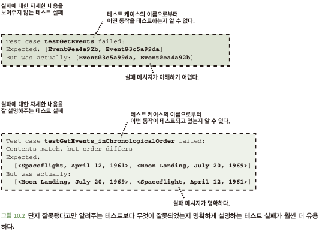

# 10.2 좋은 단위 테스트는 어떻게 작성할 수 있는가?
- 실제 코드가 작동하는지 확인만 하는 테스트 코드 -> 굉장히 잘못된 방식
- 단위 테스트에 문제가 생기면 유지 관리가 매우 어려움
- 좋은 단위 테스트가 가져야 할 5가지 주요 기능
  - 훼손의 정확한 감지: 코드가 실제로 훼손된 경우만 실패
  - 세부 구현 사항에 독립적: 세부 구현 변경해도 테스트 코드는 변경하면 안됨
  - 잘 설명되는 실패: 테스트 실패의 원인과 문제점 명확히 설명
  - 이해할 수 있는 테스트 코드: 다른 개발자가 무엇을 수행하는 테스트 코드인지 이해 가능
  - 쉽고 빠르게 실행: 단위 테스트가 느리거나 실행이 어려우면 안됨

## 10.2.1 훼손의 정확한 감지
- 단위 테스트의 가장 명확하고 주된 목표 -> 코드가 훼손되지 않았는지 확인(의도 대로 수행 확인)
- 훼손 된다면? 컴파일 되지 않거나 테스트 실패
  - 코드에 대한 초기 신뢰를 준다: 현재 작성한 코드가 병합되기 전 실수 발견 및 수정 가능
  - 미래의 훼손을 막아준다: 미래 코드 수정에 대해 이전 다른 요구 사항들에 대해 회귀 테스트 가능
- 테스트 대상 코드가 실제로 훼손된 경우에만 테스트 실패해야 함
  - '코드가 훼손되면 반드시 실패한다'고 '코드가 훼손될 때만 테스트가 실패한다'는건 아님
- 플래키: 테스트 대상 코드가 정상임에도 때로는 통과 때로는 실패하는 테스트
  - 단점 1: 개발자가 실패 원인 찾느라 시간 낭비
  - 단점 2: 테스트 계속 실패하면 짜증나서 테스트 무시 발생 -> 버그 야기 발생
- 오직 훼손된 경우만 테스트 실패!!

## 10.2.2 세부 구현 사항에 독립적
- 코드 베이스에 가할 수 있는 변경은 두 가지 종류
  - 기능적 변화: 코드가 외부로 보이는 동작 수정 -> 요구사항에 따른 기능 변경들
    - 테스트 코드 변경이 일어남
  - 리팩토링: 외부로 보이는 동작은 변경 없고, 코드의 구조적 변화 의미
    - 테스트 코드 변경이 일어나지 않음
- 테스트 코드는 동작만 테스트 할 뿐 세부사항에 의존되지 않아야 함
  - 세부 사항에 의존하면? 세부 사항 수정 마다 테스트 실패가 나며, 실패 원인이 세부 구현 문제인지 동작 수정 변화 있는지 감지가 어려움

## 10.2.3 잘 설명되는 실패
- 테스트의 주요 목적 중 하나는 미래의 훼손으로부터 코드를 보호하는 것
- 일반적인 경우 개발자가 변경한 코드로 인해 다른 사람이 작성한 코드가 동작을 하지 않는 것
- 문제 발생 시, 어떤 실패 메시지를 만들지 고민 필요 -> 그렇지 않으면 실패 원인 찾는 개발자가 많은 시간 낭비

- 테스트 실패가 잘 설명되도록 하는 좋은 방법은? 
  - 하나의 테스트 케이스는 한 가지 사항만 검사
  - 각 테스트 케이스에 대해 서술적인 이름을 사용하는거

## 10.2.4 이해 가능한 테스트 코드
- 테스트가 실패하면 코드가 작동되지 않는다? 코드가 다른 방식으로 동작한다는 것을 나타냄
- 새로운 요구사항을 반영하면? 관련 테스트 코드도 변경을 해야함
- 테스트 코드를 어렵고 추론하기 어렵게 만드는 경우는?
  - 한번에 너무 많은 것을 테스트하는 것
  - 너무 많은 공유 테스트 설정을 사용하는 것
- 일부 개발자들은 테스트를 코드에 대한 일종의 사용 설명서로 사용함

## 10.2.5 쉽고 빠른 실행
- 단위 테스트 기능 중 하나는? 잘못된 코드가 코드베이스에 병합되는 것을 방지함
- 단위 테스트 코드가 느리면 다른 개발자들의 속도도 같이 느려짐
- 개발자가 실제로 테스트를 할 수 있는 기회를 극대화하기 위함 -> 테스트가 힘든 작업이면 기피하게 됨