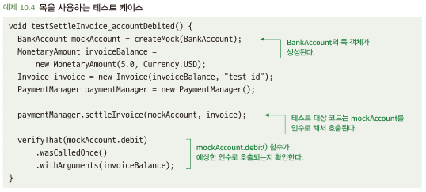

# 10.4 테스트 더블
- 단위 테스트는 '비교적 격리된 방식'으로 코드 단위를 테스트하는 것을 목표
- 테스트에서 의존성을 실제로 사용하는 것이 항상 가능하거나 바람직한 것만은 아님
- 의존성 실제 사용에 대안으로 테스트 더블이 있음
  - 목(mock)
  - 스텁(stub)
  - 페이크(fake)

## 10.4.1 테스트 더블을 사용하는 이유
- 테스트 더블을 사용해야 하는 일반적인 이유 세가지 
  - 테스트 단순화
    - 일부 의존성은 테스트에 사용하기 까다롭고 힘듬 -> 많은 설정 필요
    - 테스트 더블 활용 시, 실제 의존성 설정 하위 종속성 검증 비교적 간단히 세팅 가능
    - 또한 테스트 더 빠르게 실행 가능
  - 테스트로부터 외부 세계 보호
    - 일부 의존성은 실제로 부수 효과를 발생 -> 데이터를 실제 서버 요청으로 문제 발생
    - 이러한 부수 효과를 유발하는 테스트는 다음과 같은 문제 발생
      - 사용자는 이상하고 혼란스러운 값을 볼 수 있음: 테스트로 인해 운영에 이상한 값 반영
      - 모니터링 및 로깅에 영향을 미칠 수 있음: 오류 응답 테스트로 인해 모니터링 및 로깅에 오류로 잡힘
  - 외부로부터 테스트 보호:
    - 외부세계 비결정적에서 보호 -> 데이터 베이스 값의 변화로 인한 테스트 이상
- 의존성을 실제로 사용하는 것이 바람직하지 않거나 현실적으로 가능하지 않은 경우 존재

## 10.4.2 목 (테스트로부터 외부 세계 보호)
- 클래스나 인터페이스를 시뮬레이션하는 데 멤버 함수에 대한 호출을 기록하는 것 외 어떠한 일도 수행하지 않음
- 테스트 대상 코드에서 부수 효과를 일으키는 의존성을 시뮬레이션하는 데 가장 유용함
- verify를 통해 함수 호출에 대한 여부 확인\

- 외부 세계를 보호하는 데는 성공, But 테스트가 비현실적이고 중요한 버그를 잡지 못할 위험이 존재

## 10.4.3 스텁 (외부 세계로부터 테스트 보호)
- 함수가 호출되면 미리 정해 놓은 값을 반환함으로써 함수를 시뮬레이션함
- 대상 코드가 의존하는 코드로부터 어떤 값을 받아야 하는 경우 그 의존성을 시뮬레이션하는 데 유용
- 목과 스텁 사이에는 분명한 차이가 존재, But 개발자들이 일상적으로 목이라고 지칭(junit에서도 같이 활용)
- 테스트를 외부로부터 보호하고 결과를 신뢰할 수 있음

## 10.4.4 목과 스텁은 문제가 될 수 있다
- 목과 스텁은 2가지 단점 존재
  - 목이나 스텁이 실제 의존성과 다른 방식으로 동작되도록 설정할 수 있음 -> 테스트가 실제적이지 않음
    - 실제 값이 리턴된다는 가정을 하였지만 특정 값에 대해 Exception 일어날 수 도 있음
    - 실제 의존성이 어떻게 동작하는지 이해못하면 실수 가능성이 높음
  - 구현 세부 사항과 테스트가 밀접하게 결합하여 리팩토링이 어려워질 수 있음
    - 실제 이슈가 있어 분기처리를 통해 기존 함수를 호출하지 않는 쪽으로 변경 -> 관련 테스트 코드 전체 수정
    - 테스트는 구현 세부 사항에 구애받지 않아야 하지만...
- 필자는 목과 스텁을 최소한으로 사용하는 것이 최선이라 생각함 -> 실제 의존성이나 페이크 사용하는 것이 보통 더 바람직함

## 10.4.5 페이크
- 클래스의 대체 구현체로 테스트에서 안전하게 사용할 수 있음
- 실 구현체에 대해 페이크 형식으로 구현
- 페이크로 인해 보다 실질적인 테스트가 이루어짐
  - 호출하는 쪽에서 실제와 동일한 이슈 확인 가능 -> 실제 Exception과 같이 일어나는 경우
- 페이크를 사용하면 구현 세부 정보로부터 테스트를 분리할 수 있음
  - mock 사용하면 활용하는 측에서 세부 함수 호출 여부에 대해 확인이 필요하지만 페이크는 최종 결과한 확인
  
(?) 결국 구현에 대해 면밀해진다면 그냥 상속 받아서 외부에 영향을 끼치는 부분만 fake 처리하면 전체 구현이 필요 없지 않을까?

## 10.4.6 목에 대한 의견
- 단위 테스트에서 목과 스텁을 사용하는 것에 관한 2가지 의견
  - 목 찬성론자: 단위 테스트 코드에서 실제 의존성을 사용하는 것을 피해야함
  - 고전주의자: 목과 스텁 사용을 최소화. 실제 의존성을 최우선으로 사용하자
- 목 사용은 테스트 상호작용을 테스트하는 반면, 고전주의 방법은 코드의 결과 상태와 의존성 테스트 하는 경향
  - 시험 대상 코드가 어떻게 하는가 <-> 코드 실행 시 최종결과가 무엇인지 확인
- 필자는 고전적인 접근법에 더 강하게 선호
