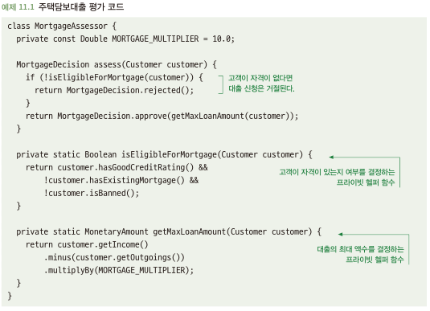
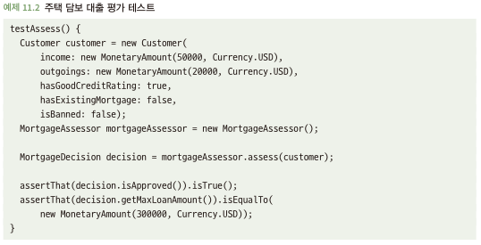

# 11.1 기능뿐만 아니라 동작을 시험하라
- 테스트 대상 코드가 수행하는 작업이 여러 가지가 있으며 각각의 작업에 대해 테스트 케이스를 따로 작성해야함
- 개발자들이 가끔 저지르는 실수는 테스트할 목록에 함수 이름만 추가하는 것
  - 클래스에 함수가 2개 있으면 함수 마다 하나의 테스트 케이스를 작성하는 식
- 함수가 수행하는 모든 동작을 테스트하는 것이 중요함

## 11.1.1 함수당 하나의 테스트 케이스만 있으면 적절하지 않을 때가 많다
- 아래 코드에서 대출이 거절될 수 있는 경우는 한가지가 아님\

- 여기서 문제는 아래와 같이 행동이 아닌 기능 테스트를 집중했다는 점\

- 해당 코드는 올바른 방식으로 동작 확인에 대한 테스트 의미 밖에 되질 못함

## 11.1.2 해결책: 각 동작을 테스트하는 데 집중하라
- 함수와 동작 사이에 일대일로 연결이 안되는 경우가 많음
- 테스트 코드의 양이 실제 코드의 양보다 많지 않다면, 모든 동작이 제대로 테스트 되고 있지 않음을 나타내는 경고 표시일 수 있음
- 코드가 보일 행동을 생각해 내는 연습을 하는 것이 코드의 잠재적인 문제를 발견하는 좋은 방법
- 모든 동작이 테스트되었는지 거듭 확인하라
  - 제대로 테스트되는지 여부를 측정하는데 좋은 방법은? 수정된 코드에 버그나 오류가 있음에도 여전히 테스트를 통과할 수 있는지 생각해보기
    - 삭제해도 여전히 컴파일되거나 테스트가 통과하는 코드 라인이 있는가?
    - if문의 참 거짓 논리를 반대로 해도 테스트가 통과하는가?
  - 필요한 코드만 존재해야하며, 그 동작을 테스트 하는 테스트 케이스가 존재해야함 -> 해당되지 않는 불필요한 코드를 없애자
- 오류 시나리오를 잊지 말라
  - 오류 시나리오가 발생할 때 코드가 어떻게 동작하는지 확인
  - 코드가 서로 다른 오류 시나리오를 처리하고 알리는 방법은 코드 작성자나 호출자에게 중요한 동작임
- 함수당 하나의 테스트 케이스만 작성하는 것으로 테스트가 충분히 되는 경우는 거의 없음 -
- 함수 보단 궁국적인 중요한 행동을 파악하고 테스트 케이스 작성하자