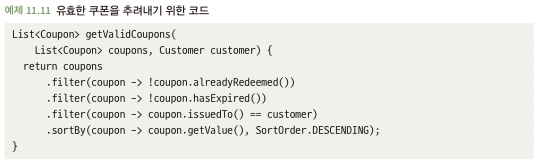
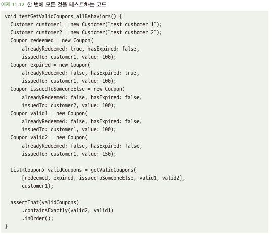
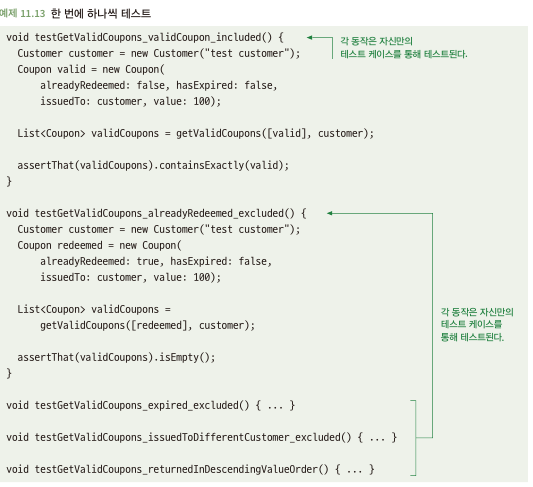
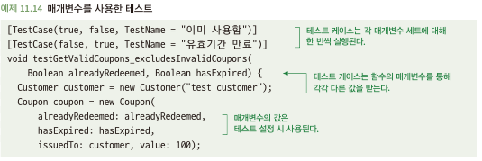
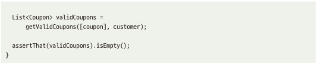

# 11.3 한번에 하나의 동작만 테스트하라
- 각각의 동작을 테스틓하려면 각각의 시나리로 별도 케이스로 테스트하는 것이 가장 자연스러움

## 11.3.1 여러 동작을 한꺼번에 테스트하면 테스트가 제대로 안 될수 있다
- 아래 코드와 같은 경우 여러가지 조건에 로직이 존재하는 함수임\

- 하나에 테스트 케이스에 위에 조건을 다 넣으려고 하니 이해하기 어려운 테스트 코드가 됨\

- 테스트 코드가 이해하기 어렵고 통과하지 못한 경우 이유를 제대로 설명하지 않으면? 다른 개발자가 고생함

## 11.3.2 해결책: 각 동작은 자체 테스트 케이스에서 테스트하라
- 잘 명명된 테스트 케이스를 사용하여 각 동작을 개별적으로 테스트하자
  - 다른 개발자가 이해하기도 좋음
  - 테스트 실패에 대해 이유를 제대로 분별 가능\

## 11.3.3 매개변수를 사용한 테스트
- 많은 코드를 반복하지 않고도 모든 동작을 테스트할 때 좋음\
\
