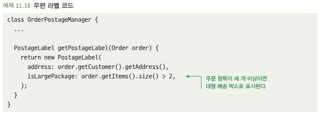
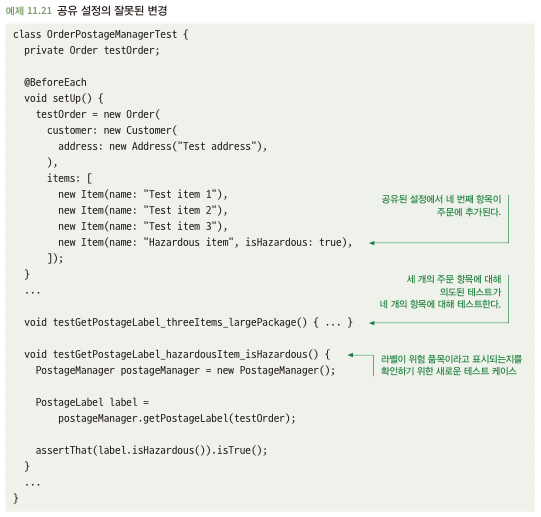
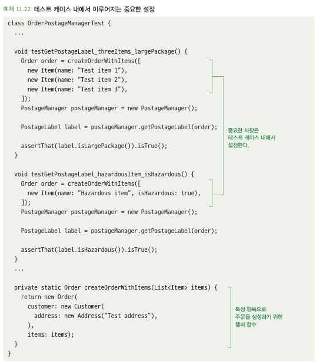

# 11.4 공유 설정을 적절하게 사용하라
- 테스트 케이스는 의존성을 설정하거나 다른 종류의 상태를 초기화하는 등 어느 정도의 설정이 필요할 때가 존재
- 많은 테스트 프레임워크에서 테스트 케이스간에 설정을 쉽게 공유할 수 있는 기능을 제공 
  - 전처리: BeforeAll, BeforeEach
  - 후처리: AfterAll, AfterEach
- 서로 다른 테스트 케이스 간에 공유는 2가지 방식으로 일어남
  - 상태 공유
  - 설정 공유
- 잘못된 방법으로 테스트 설정을 공유하면 테스트가 취약하고 효과적이지 못함

## 11.4.1 상태 공유는 문제가 될 수 있다
- 테스트 케이스는 서로 격리되어야 함 -> 한 테스트 케이스가 수행하는 모든 조치는 다른 테스트 케이스의 결과에 영향을 미치지 않아야함
- 테스트 케이스 간에 상태를 공유하고 이 상태가 가변적이면 위의 규칙이 깨지기 쉬움
  - 전 테스트 케이스에서 상태를 변경하였는데, 변경된 상태 값으로 인해 다른 테스트 케이스에서 실패가 나야하는데 통과가 됨

## 11.4.2 해결책: 상태를 공유하지 않거나 초기화하라
- 각자의 값을 생성하여 사용하던가, AfterEach를 통해 상태값을 초기화 하자

## 11.4.3 설정 공유는 문제가 될 수 있다
- 아래와 같이 설정쪽 값을 통해 결과에 영향을 미치는 로직이 존재\

- 다른 개발자가 설정된 값을 변경하였을 경우 테스트의 정확성이 깨짐\

## 11.4.4 해결책: 중요한 설정은 테스트 케이스 내에서 정의하라
- 테스트 케이스가 특정 값이나 설정 상태에 의존하면 테스트 케이스 내에서 설정하자
- 반복되는 설정에 대해 헬퍼함수로 중복성 제거\

## 11.4.5 설정 공유가 적절한 경우
- 테스트 결과에 직접적인 영향을 미치지 않는 것에 대해서는 설정 공유 활용 가능
- 적절하게 사용하기를 위해 심사숙고할 필요가 있음