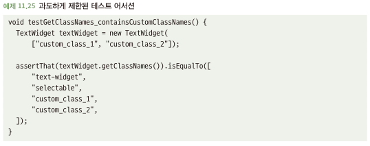
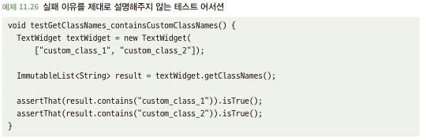
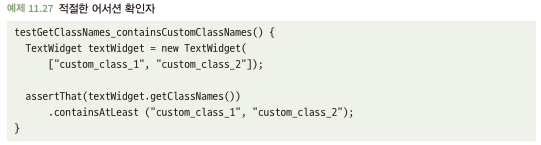
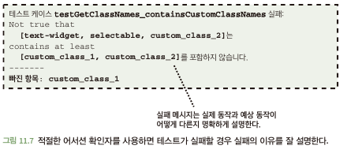

# 11.5 적절한 어서션 확인자를 사용하라
- 테스트 통과 여부를 최종적으로 결정하기 위한 테스트 케이스 내 코드

## 11.5.1 부적합한 확인자는 테스트 실패를 잘 설명하지 못할 수 있다
- 아래 소스 코드는 과도한 제한으로 문제를 야기시키는 테스트 코드임\
\

  - 의도한 것보다 많은 것을 테스트하면 반환 순서가 틀어지면 테스트 실패 발생 -> 왜 실패했는지 확인도 힘듬
- 코드에 정말로 문제가 있을 때에만 테스트 실패하고 이유를 잘 설명해야함

## 11.5.2 해결책: 적절한 확인자를 사용하라
- 순서와 상관없이 값 비교하고, 이유도 잘 설명할 수 있는 확인자 활용\

- 의도에 맞게 확인자를 잘 활용하자
