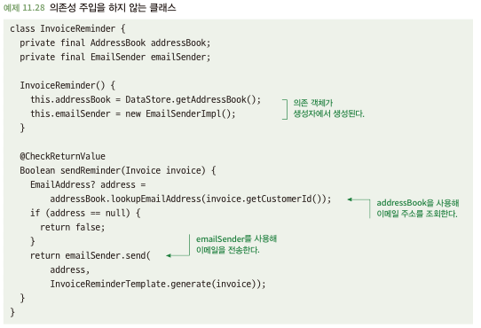

# 11.6 테스트 용이성을 위해 의존성 주입을 사용하라
- 테스트 대상 코드에서 의존성을 직접 생성하면 의존성에 대한 대처가 안될 경우 테스트가 힘듬

## 11.6.1 하드 코딩된 의존성은 테스트를 불가능하게 할 수 있다
- 아래와 같이 의존성을 클래스에서 직접 생성해주는 경우 다음과 문제를 발생 시킴\

  - 실제 데이터 연동을 통해 작업할 수 밖에 없음 -> 결과 값이 시간에 따라 변경이 되기에 테스트 결과도 달라짐
  - 외부 연동에 대한 부수효과도 발생

## 11.6.2 해결책: 의존성 주입을 사용하라
- 의존성 주입을 사용하면 테스트 더블을 통해 테스트 용이성을 높일수 있음\

