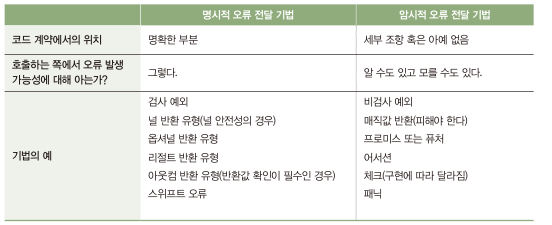

## 4.3 오류 전달 방법
- 오류 발생하면 더 높은 계층으로 오류를 알려야함.
  - 복구 할수 없는 오류: 높은 계층에서 실행 중지, 오류 기록 또는 프로그램 실행 종료
  - 복구 가능: 호출하는 쪽에 오류를 알려 정상적 처리할 수 있도록 도움
- 오류를 알리는 방법은 크게 두 가지 종류오 나뉨
  - 명시적 방법: 호출하는 쪽에서 인지할 수밖에 없도록 처리, 처리 여부는 호출하는 쪽에서 담담
  - 암시적 방법: 호출하는 쪽에 오류를 알리지만, 오류 신경쓰지 않아도 됨
  

## 4.3.1 요약:예외
- 자바는 검사 예외(checked exception)와 비검사 예외(unchecked exception)를 가짐
- 대부분 언어는 비검사 예외만 가짐

## 4.3.2 명시적 방법: 검사 예외
- 컴파일러는 검사 예외에 대해 호출하는 쪽에서 예외 인지 및 강제 조치
- 검사 예외를 사용한 오류 전달
  - Exception 클래스를 확장하면 검사 예외
  - 함수의 시그니처에 throws 를 통한 예외 발생 명시
- 검사 예외 처리
  - try catch로 직접 처리
  - 함수 시그니처에 throws 를 붙여 해당 함수를 호출하는 쪽으로 위임

## 4.3.2 암시적 방법: 비검사 예외
- 다른 개발자들은 코드가 이 예외를 발생시킬 수 있다는 사실을 전혀 모를 수 있음
- 문서로 남기기도 하지만... 코드 계약의 세부 조항이므로 신뢰성이 떨어짐
- 비검사 예외를 사용한 오류 전달
  - RuntimeException 클래스 확장하면 비검사 예외
- 비검사 예외 처리
  - try catch로 직접 처리
  - 해당 함수를 호출하는 쪽은 전혀 몰라도 됨

## 4.3.4 명시적 방법: 널값이 가능한 반환 유형
    