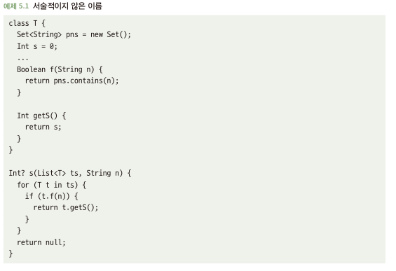

# 5.1 서술형 명칭 사용
- 이름은 사물을 고유 식별에 필요, 무엇인지에 대해 간단히 설명할 때도 많음
- 이름을 붙이는 것은 그것이 스스로 설명되는 방식으로 언급함 -> 쉽게 읽히는 코드 작성 기회

## 5.1.1 서술적이지 않은 이름은 코드를 읽기 어렵게 만듬
- 서술적인 이름을 짓지 않으면 코드가 무엇을 하는지 이해하기 힘듬\

## 5.1.2 주석문으로 서술적인 이름을 대체할 수 없다
- 5.1.1 예시를 개선할 수 있는 방법중 하나는? 주석문과 문서 추가, But 조금만 개선될뿐...
  - 코드가 훨씬 복작해지고, 다른개발자도 해당 부분을 유지보수해야함
  - 개발자가 코드 이해를 위해 병행해서 봐야함
  - 코드상 함수 시그니처만 보고 무엇을 하는지 또는 뭘 반환하는지 알기 힘듬\

## 5.1.3 해결책: 서술적인 이름 짓기
- 서술적인 이름을 사용하면 어려운 코드가 갑자기 이해하기 쉬운 코드로 바뀜
- 주석문과 문서가 가진 단점을 없애줌\
