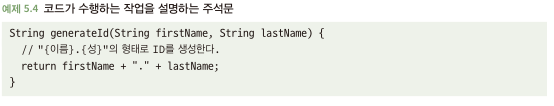
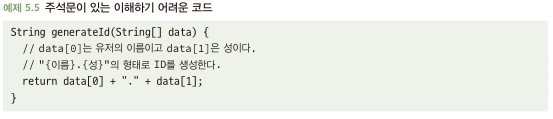
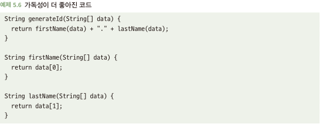
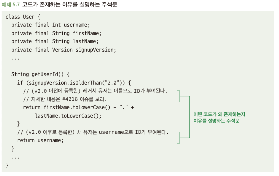

# 5.2 주석문의 적절한 사용
- 코드 내 주석문이나 문서화는 아래와 같이 다양한 목적을 수행
  - 코드가 무엇을 하는지 설명
  - 코드가 왜 그 일을 하는지 설명
  - 사용 지침 등 기타 정보 제공
- 클래스와 같이 큰 단위의 코드가 무엇을 하는지 요약하는 높은 수준에서의 주석문은 유용 
- But 한줄 한줄 코드가 무엇을 하는지에 대한 하위 수준에서의 주석문은 효과적이지 않음
- 서술적인 이름으로 잘 작성된 코드는 그 자체로 줄단위에서 무엇을 하는지 설명함
- 코드가 왜 그 일을 하는지에 대한 이유나 배경은 유용

## 5.2.1 중복된 주석문은 유해할 수 있음
- 아래와 같은 코드는 주석문은 불필요
  - 개발자는 코드를 변경하면 주석문 수정 필요
  - 코드를 지저분하게 만듬

## 5.2.2 주석문으로 가독성 높은 코드를 대체할 수 없다
- 아래와 같은 경우는 코드 자체가 읽히기가 어려워 주석을 씀 -> 하지만 이는 좋은 방법이 아님

- 차라리 아래와 같이 코드 자체로 가독성을 높은 코드가 더 좋은 코드임

## 5.2.3 주석문은 코드의 이유를 설명하는 데 유용하다
- 코드가 '그 일을 왜 수행하는지'는 코드로 설명하기 어려움
- 배경 상황이나 지식이 코드를 이해하거나 안전하게 수정하기 위해 중요한 경우 -> 주석문은 유용함
  - 제품 또는 비즈니스 의사 결정
  - 이상하고 명확하지 않은 버그에 대한 해결책
  - 의존하는 코드의 예상을 벗어나는 동작에 대처
- 아래와 같은 경우는 코드를 약간 지저분하게 만들지만 주석으로 인해 이점이 큰 경우

## 5.2.4 주석문은 유용한 상위 수준의 요약 정보를 제공할 수 있다
- 코드가 무슨일을 하는지 설명하는 주석문과 문서는 마치 책을 읽을 때 줄거리와 같음
  - 다른 개발자가 그 클래스가 그들에게 유용한지에 대해 가늠할 수 있게 간략히 작성
- 코드 기능에 대한 상위 수준에서의 개략적인 문서는 다음과 같은 때 유용
  - 클래스가 수행하는 작업 및 관련된 중요한 세부 사항을 개괄적으로 설명하는 문서
  - 함수에 대한 입력 매개변수 또는 기능을 설명하는 문서
  - 함수의 반환 값이 무엇을 나타내는지 설명하는 문서
- 주석문과 문서는 이점도 있지만 유지보수하는 부담 -> 균형 잡힌 접근법 필요 
