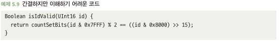
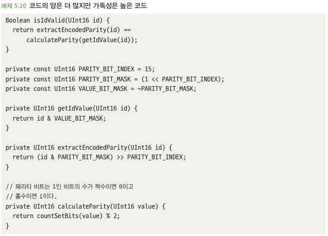

# 5.3 코드 줄 수를 고정하지 말라
- 코드베이스의 코드 줄 수는 적을 수록 좋음
- 코드가 많다는건? 
  - 코드가 지나치게 복잡
  - 재사용이 부족하다는 신호
  - 읽어야할 코드가 많아 개발자 인지 부하 증가
- 코드를 무조건 줄이는건 좋다? 코드 줄수는 간접적 측정이기에 아래와 같은 사항이 더 중요
  - 이해하기 쉽다
  - 오해하기 어렵다
  - 실수로 작동이 안되게 만들기가 어렵다

## 5.3.1 간결하지만 이해하기 어려운 코드는 피하라
- 아래와 같은 코드는 간결하지만 이해하기가 어려움 -> 이해하기 위해 많은 가정과 복잡성을 가짐

- 모든 세부 사항을 매우 간결하게 할 때는 아래와 같은 문제 야기
  - 이해하는데 시간이 많이 들고, 잘못 이해하였을 경우 문제 발생
  - 위에 있는 코드가 다른 코드도 동일해야함 -> 이는 실질적으로 어려움... 다른쪽이 수정될 수 도 있으니까...

## 5.3.2 해결책: 더 많은 줄이 필요하더라도 가독성 높은 코드를 작성하라
- 더 많은 줄의 코드를 작성해서 많은 가정과 세부 사항을 코드로 읽기 쉽게되는 것이 훨씬 더 좋음

