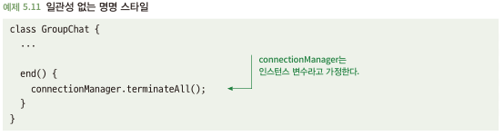
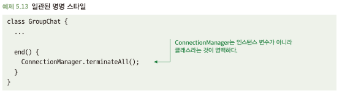

# 5.4 일관된 코딩 스타일을 고수하라
- 잘 읽히는 문장을 쓰기 위해 따라야할 지침들이 있음
  - SaaS를 SAAS로 쓴다면? 읽는 사람이 SaaS가 아닌 다른걸 지칭한다고 오해
- 프로그래밍 언어의 구문과 컴파일러는 규정해주지만, 개발자 코드 작성 스타일은 자유도가 높음

## 5.4.1 일관적이지 않은 코딩 스타일은 혼동을 일으킬 수 있다
- 일반적으로 클래스 이름은 파스칼 케이스이고, 변수는 카멜 케이스로 활용됨
- 아래와 같은 코드에서 우리는 connectionManager라는 인스턴스 변수로 terminateAll()가 호출됨을 인지할 수 있음

- 하지만 connectionManager가 클래스이고, terminateAll() 정적함수여서 모든 채팅이 다 종료되면? 문제 발생...

## 5.4.2 해결책:스타일 가이드를 채택하고 따르라
- 아래와 같이 스타일 가이드를 따라 작성하면 코드 읽기로 영향도 예측 가능

- 코딩 스타일은 명명법 말고도 아래와 같은 많은 측면을 다룸
  - 언어의 특정 기능 사용
  - 코드 들여쓰기
  - 패키지 및 디렉터리 구조화
  - 코드 문서화 방법
- 스타일 가이드를 잘 따른다면? 서로 오해할 위험도 적으면서 버그도 줄고 코드 이해도도 높아짐

