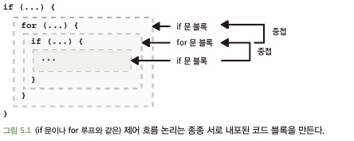
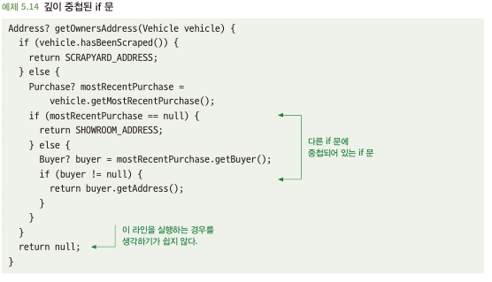
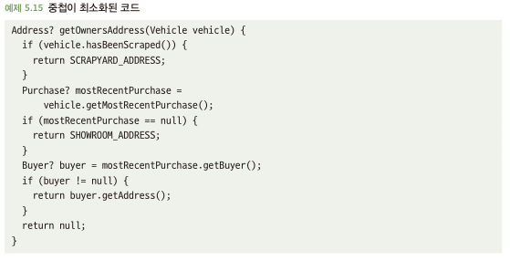

# 5.5 깊이 중첩된 코드를 피하라
- 코드는 다음과 같이 서로 중첩되는 블록으로 구성됨
  - 함수가 호출되면 그 함수가 실행되는 코드
  - if문의 조건이 참일 때 실행되는 코드
  - for루프의 각 반복시 실행되는 코드
- 중첩이 코드 가독성의 어떤 영향을 미칠지 고려하는 것이 중요

## 5.5.1 깊이 중첩된 코드는 읽기 어려울 수 있다
- 아래 코드가 읽기 어려운 이유는? 우선 눈으로 따라가기 어렵고, 특정 값 반환되는 시점을 파악하기 위해 밀집된 논리 탐색해야함

## 5.5.2 해결책: 중첩을 최고화하기 위한 구조 변경
- 중첩 if문을 피하기 위해 논리를 재구성하는 것이 쉬울때가 많음 
- 중첩된 모든 블록에 반환문이 있을때? 중첩을 피하기 위해 논리 재배치(early return)
- 중첩된 블록에 반환문이 없을때? 함수가 너무 많은 일을 하고 있음

## 5.5.3 중첩은 너무 많은 일을 한 결과물이다
- 너무 많은 일을 하면 중첩이 많이 생김 -> 더 작은 함수로 나누면 문제 해결

## 5.5.4 해결책: 더 작은 함수로 분리
- 너무 많은 일들을 하나씩 쪼개서 함수로 만들어 적용하면? 중첩이 적어짐
