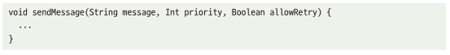
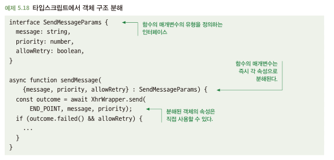
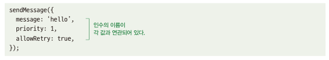
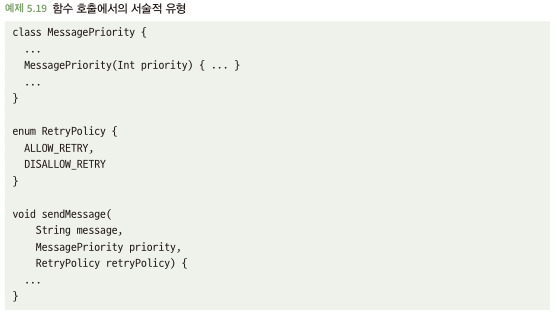
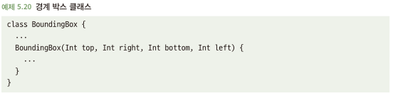
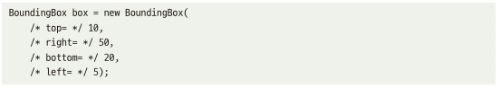

# 5.6 함수 호출도 가독성이 있어야 한다
- 어떤 함수의 이름이 잘 명명되면 무슨 일 하는지 분명
- But 함수 인수가 무엇이고 무슨 역할을 하는지 명확하지 않다면 함수 호출 자체가 이해되지 않을 수 있음

## 5.6.1 매개변수는 이해하기 어려울 수 있다
- 아래와 같은 경우, 1이나 true 값이 무엇을 의미하는지 알기 어려움

- 아래와 같이 함수 정의를 들여야 다봐야 해당 인수가 뭘 뜻하는지 알수 있음 -> 가독성이 떨어지는걸 뜻함

## 5.6.2 해결책: 명명된 매개변수 사용
- 명명된 매개변수는 최근 나온 언어에서 지원

- '명명된 매개변수' 지원하지 않으면? TypeScript에서는 객체 구조 분해 활용 

- 다른 언어에서는 비슷하게 만들어 사용할 지라도 다른 개발자가 익숙하지 않으면 더 많은 문제 일으킬 수도 있음

## 5.6.3 해결책: 서술적 유형 사용
- 어떤 종류의 값이라도 의미 있어 보이게 처리 -> 클래스 및 열거형 활용
- (?)원시값과 문자열의 포장 연관? https://developerfarm.wordpress.com/2012/01/27/object_calisthenics_4/

## 5.6.4 때로는 훌룡한 해결책이 없다
- 함수를 호출하는 라인의 가독성을 높여주는 특별한 방법이 없을 때도 존재

- 최선의 방법은 생성자를 호출할 때 각 인수에 대한 인라인 주석 사용

- setter나 빌더 패턴은? 값 누락 또는 오용되기 쉬운 단점 존재

## 5.6.5 IDE는 어떤가?
- 코드 편질할 때는 좋지만, 코드 가독성을 위해 기능 의존하지 않아야함 -> 모두가 활용한다는 가정은 무의미
- 코드 자체로 가독성 높이게 짜는게 좋음

