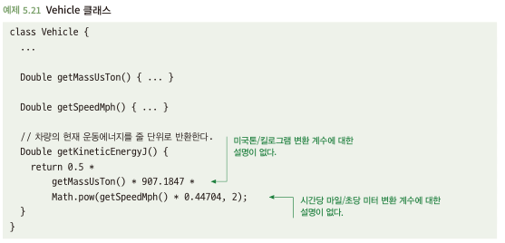
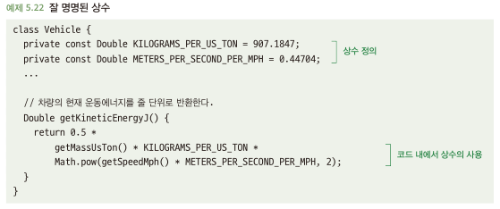
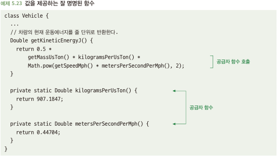
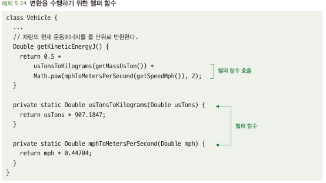

# 5.7 설명되지 않은 값을 사용하지 말라
- 하드 코드로 작성된 값은 아래와 같이 필요한 경우 존재
  - 한 수량을 다른 수량으로 변환할 때 사용하는 계수
  - 작업이 실패할 경우 재시도의 최대 횟수와 같이 조정 가능한 파라미터 값
- 하드 코드로 작성된 모든 값에는 두 가지 중요 정보 존재
  - 값이 무엇인지: 컴퓨터가 코드를 실행할 때 이 값을 알아야 함
  - 값이 무엇을 의미하는지: 개발자가 코드를 이해하려면 값의 의미를 알아야함
- 값이 무엇있지는 컴파일 오류 또는 에러 발생, But 값이 무엇을 의미하는 지는 잊혀지기 쉬움...

## 5.7.1 설명되지 않은 값은 혼란스러울 수 있다
- 아래와 같은 코드를 처음 본 개발자는 각 상수들이 어떤 의미를 갖는지 파악하기 어려움 -> 소스 수정시 문제 발생 가능성 높음\

## 5.7.2 해결책: 잘 명명된 상수를 사용하라
- 상수를 정의하고 상수 이름을 통해 값을 설명하라\

## 5.7.3 해결책: 잘 명명된 함수를 사용하라
- 코드의 가독성을 높이는 함수 2가지 방법
  - 상수를 반환하는 공급자 함수
  - 변환을 수행하는 헬퍼 함수
- 공급자 함수
  - 개념적으로 상수를 사용하는 것과 같음\

- 헬퍼 함수
  - 하위 문제를 만들어 해당 기능을 전문적으로 수행하는 함수\
