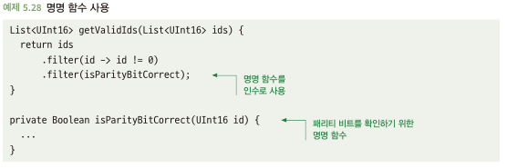

# 5.8 익명함수를 적절하게 사용하라
- 이름이 없으며, 인라인으로 정의
- 간단하고 자명한 것에 활용하면 좋음
- 복잡하거나 자명하지 않은 것 또는 재사용해야하는 것에 사용하면 문제 발생

## 5.8.1 익명 함수는 간단한 로직에 좋다
- 간단한건 익명함수를 활용하면 좋음
- 명명 함수로 정의려면 보일렛 코드가 많이 필요하며 이는 가독성을 떨어뜨릴수 있음

## 5.8.2 익명 함수는 가독성이 떨어질 수 있다
- 익명 함수의 내용이 자명하지 않으면 가독성이 떨어짐

## 5.8.3 해결책: 대신 명명 함수를 사용하라
- 내용이 자명하지 않은 것들은 명명 함수를 활용하자

## 5.8.4 익명 함수가 길면 문제가 될 수 있다
- 익명 함수를 쓴다고 무조껀 가독성이 좋아지는건 아님
- 익명 함수가 두세줄 이상으로 늘어나면? 명명함수로 분리하는게 좋음

## 5.8.5 해결책: 긴 익명 함수를 여러 개의 명명 함수로 나눠라
- 익명 함수가 길어지고 복잡해지면, 로직을 더 작은 단위의 명명 함수로 작성하자

