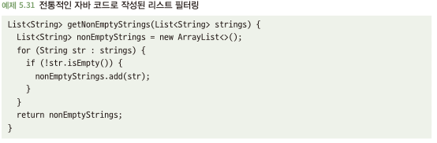
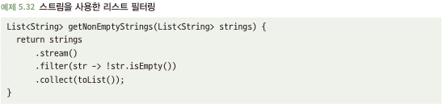

# 5.9 프로그래밍 언어의 새로운 기능을 적절하게 사용하라
- 프로그래밍 언어 설계자는 새로운 기능 추가 시 신중하게 생각하고 행함 -> 새로운 기능들은 견고하고 가독성이 높은 경우가 많은
- 새로운 기능도 좋지만, 이것이 정말 그일에 적합한 도구인지 판단하는게 더 중요

## 5.9.1 새 기능은 코드를 개선할 수 있다
- 아래와 같은 명령형 코드 보다 스트림을 이용한 함수형 코드가 가독성과 버그가 없을 가능성(멀티스레드 환경에서)이 큼

## 5.9.2 불분명한 기능은 혼동을 일으킬 수 있다
- 확실한 이점을 가지고 있는 기능이라도 다른 개발자에게 얼마나 잘 알려져 있는지도 중요 -> 유지보스는 다른 사람도 하니까
- 다른 개발자가 익숙하지 않은 기능을 활용 시, 다른 사람이 실수를 초래할 수 있음

## 5.9.3 작업에 가장 적합한 도구를 사용하라
- 새로운 기능이라도 무조건적으로 이점만 있지는 않음
- 새로운 기능이 생긴건 다 이유가 있으면, 해당 이유에 맞게 활용해야함