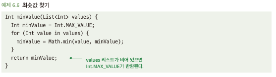

# 6.1 매직값을 반환하지 말아야 한다
- 매직 값을 정상 반환으로 오인하여 예측하지 못하는 문제 발생 

## 6.1.1 매직값은 버그를 유발할 수 있다
- 일부 레거시에서는 매직 값을 활용 -> 오류 전달 기법이나 널 또는 옵셔널 타입 반환이 안된 경우
  - indexOf() 값이 -1 인 경우
- 해당 이슈에 대한 원인 사항을 찾기가 어려움

## 6.1.2 해결책: 널, 옵셔널 또는 오류를 반환하라
- 차라리 널 또는 옵션널을 반환하는 것이 함수 호출하는 쪽에서 예측하기가 더 좋음

## 6.1.2 때때로 매직값이 우연히 발생할 수 있다
- 하기와 같이 코드를 짰을때, 의도치 않게 매직 값이 발생할 수 있음\

- 차라리 널이나 옵셔널을 명확히 반환하자
