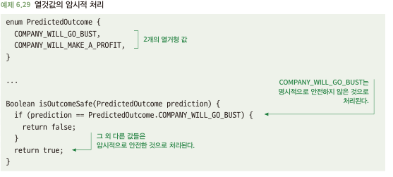
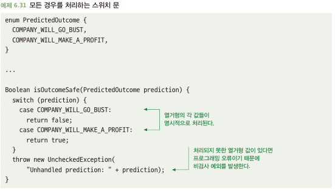
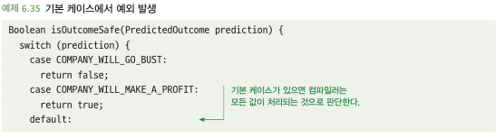
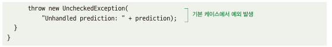

# 6.6 미래를 대비한 열거형 처리
- 우리가 의존하는 코드가 부실할 경우는?
  - 함수 시그니처에 오해 부분 존재 -> 사용하는 입장에서 잘못 인지
- 열거형
  - 옹호론자: 안전성 제공, 유효하지 않은 입력 값 방지
  - 비관론자: 특정 값 처리에 대한 논리가 코드 전반에 전파 -> 추상화 계층을 막음\
    (?) 해당 부분 이해가 잘...
- 열거형을 처리하는 경우, 미래에 열거형에 더 많은 값이 추가 될 수 있음을 고려

## 6.6.1 미래에 추가될 수 있는 열것값을 암묵적으로 처리하는 것은 문제가 될 수 있다
- 아래와 같이 다른 값을 암묵적으로 처리하면? 값이 추가되었을 때, 예상치 못한 상황 발생\

## 6.6.2 해결책: 모든 경우를 처리하는 스위치문을 사용하라
- 더 나은 접근법은 모든 열거 값을 명시적으로 처리 
- 새로운 열거 값이 없을 경우 컴파일 실패나 테스트 실패 처리\

## 6.6.3 기본 케이스를 주의하라
- 기본 케이스(default)처리를 주의하라 -> 해당 부분도 미래 추가될 값에 대해 암묵적 처리와 유사
- 기본 케이스에서 예외 발생
  - 아래와 같은 코드는 새로운 값이 추가되어도 IDE쪽에서 default쪽에서 이미 처리한 걸로 예측 -> warning 발생 안함\
  
\
  
  
## 6.6.4 주의 사항: 다른 프로젝트의 열거형에 의존
- 다른 프로젝트나 조직이 개발한 코드의 열거형에 의존\
  (?) 예를 들어 오픈소스 라이브러리 가져와서 해당 열거형을 내쪽 소스에서 활용?
- 의존하는 코드에서 알려주지 않고 새로운 값을 추가하거나 작동하지 않을 수 있음 -> 허용범위에 대한 판단이 필요
