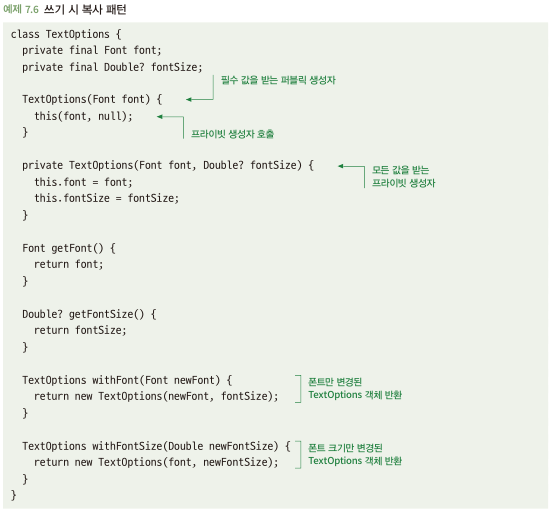

# 7.1 불변 객체로 만드는 것을 고려하라
- 불변: 객체가 생성된 후 상태를 바꿀 수 없음
- 가변 객체는 문제를 일으킬 가능성이 존재
  - 가변 객체는 추론하기 어려움 -> 중간에 어떤 함수에서 값이 변경되었는지 추론하기 힘듬
  - 가변 객체는 다중 스레드에서 문제가 발생할 수 있음 -> 객체에 스레드 동시 접근으로 문제 발생

## 7.1.1 가변 클래스는 오용하기 쉽다
- 클래스를 가변적으로 만드는 방법은? setter 함수 제공
- setter 함수 제공은 어떤 곳이든 값 변경이 가능함 -> 예상치 못한 곳에서 값 변경 가능

## 7.1.2 해결책: 객체를 생성할 때만 값을 할당하라
- 생성자를 통해 값 할당 -> 생성 후 값 변경 불가능
- 클래스 내 값 수정 못하게 하는 방법도 존재 -> 언어에 따란 const,final,readonly 등 존재
- 객체 내 값 변경이 필요하면? 복수 패턴 활용(-> 복사된 객체 내 해당 값만 변경)

## 7.1.3 해결책: 불변성에 대한 디자인 패턴을 사용하라
- 세터 함수 없애고 클래스를 불변적으로 만들면 버그 방지
- But, 클래스 값 변경 유연성이 떨어져 별로 쓸모 없어질지도...
- 일부 값이 필요하지 않거나 불변적 클래스를 가변적으로 만들어야하는 경우는 빌더 패턴 or 쓰기 시 복사 패턴 활용
- 빌더 패턴
  - 값을 하나씩 설정할 수 있는 빌더 클래스 / 빌더에 의해 작성된 불변적인 읽기 전용 클래스
  - 생성자를 통해 필수 값 받고, 나머지는 빌더의 setter 함수를 통해 받기
  - 값의 일부가 선택사항일 때 유용
- 쓰기 시 복사 패턴
  - 원하는 값만 변경된 새로운 객체 생성\
