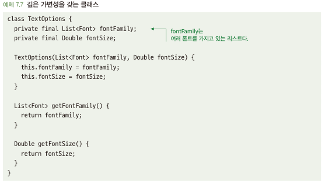
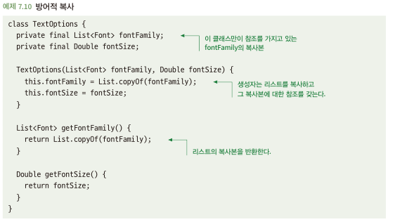
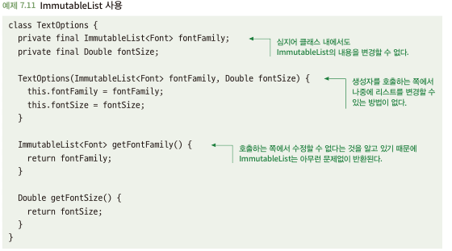

# 7.2 객체를 깊은 수준까지 불변적으로 만드는 것을 고려하라
- 깊은 가변성: 클래스가 실수로 가변적으로 될 수 있는 일반적인 경우
  - 멤버 변수 자체가 가변적 유형(객체나 콜렉션)일 경우

## 7.2.1 깊은 가변성은 오용을 초래할 수 있다
- 클래스 내 fontFamily 변수가 참조에 의해 접근 가능 -> fontFamily 내 값 변경 가능\

- 이러한 가변은 문제점 찾기를 정말 어렵게 함

## 7.2.2 해결책: 방어적으로 복사하라
- 참조에 의해 외부에서 깊은 가변성 문제 발생 -> 외부에서 참조 할 수 없게 처리
- getter 함수를 통해 객체 반환 할때, 복사본 제공\

- 단점
  - 복사하는데 비용이 많이 들수 있음
  - 클래스 내부에서 발생하는 변경을 막아주지 못하는 경우가 많음\
    (?) 복사 값을 전달하면 실 클래스 내 객체 변수는 변경이 안되지 않나?

## 7.2.3 해결책: 불변적 자료구조를 사용하라
- 기존 언어에서 제공하면 활용하고 라이브러리 활용하여 사용
  - Java: Guava Immutablelist 클래스 활용\
  
