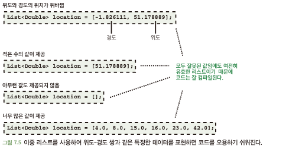
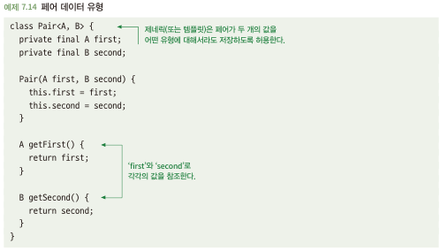
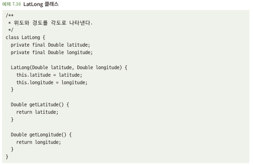

# 7.3 지나지체 일반적인 데이터 유형을 피하라
- 정수, 문자열 및 리스트 같은 간단한 데이터 유형은 굉장히 일반적이고 다재다능함\
-> 데이터 유형 자체만으로 무언가 설명할 수 가 없으면, 가질수 있는 값에 대해 관대함

## 7.3.1 지나치게 일반적인 유형은 오용될 수 있다
- 지나치게 일반적인 유형은 코드 계약의 세부 조항에 대한 자세한 지식 없이 함수 올바르게 호출 불가능\
  
- 패러다임은 퍼지기 쉽다
  - 한번 유형을 잡은 부분은 다른 곳에서도 같은 패러다임으로 활용됨

## 7.3.2 페어 유형은 오용하기 쉽다
- 위에 위도 경도를 Pair형으로 활용 -> 위에 언급한 잘못된 활용에 대해 일부는 해결 가능\

- But, List가 들어간 List<Pair<Double,Double>>을 활용하면 무슨 의미인지 가독성이 떨어짐
- 또한 여전히 위도와경도에 대한 값의 위치가 변경되어서 들어갈 수 있음

## 7.3.3 해결책: 전용 유형 사용
- 경도 위도를 나타내는 전용 클래스 정의
- 무언가 구체적인 것을 나타낼 필요가 있을대, 전용 유형을 정의하는 것이 더 나음 -> 오용하기 어려움\

