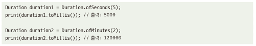

# 7.4 시간 처리
- 시간 데이터를 다루는 것은 생각보다 까다로움
  - 어떤 때는 '1969년 7월 21일 UTC'와 같은 절대 값이 '5분 내'와 같은 상대적인 시간으로 표현
  - 표준 시간대, 윤년, 윤초 등과 같은 개념 존재

## 7.4.1 정수로 시간을 나타내는 것은 문제가 될 수 있다
- 시간을 나타낼 때, 정수나 큰 정수 사용 -> 시각과 시간의 양 표현
  - 유닉스 시간을 나타냄(22041212487)
  - 양으로서의 시간은 초 혹은 밀리초 단위로 표시할 때가 많음(3000[ms])
- 한순간의 시간인가, 아니면 시간의 양인가?
  - 매개변수로 시간의 값이라고 하여 정수 값이 옴 -> 절대 시간인지, 시간에 대한 양인지 모호함
- 일치하지 않는 단위
  - 내부 클래스에 정수 값 단위에 대한 불일치(5라는 값에 대해 초, 밀리초 등으로 활용)
- 시간대 처리 오류
  - timestamp에 대한 정수는 국가별 시간이 다름을 표현함

## 7.4.2 해결책: 적절한 자료구조를 사용하라
- 양으로서의 시간과 순간으로서의 시간의 구분
  - Java 내 time 패키지에서 Duration을 통해 시간의 양을 표현
- 더 이상 단위에 대한 혼동이 없다
  - duration과 같은 유형이 단위가 내부에 캡슐화 되어 있음\
  
- 시간대 처리 개선
  - LocalDateTime을 활용 ->(?) 해당 부분 어떻게 처리한다는건지 이해가 잘...