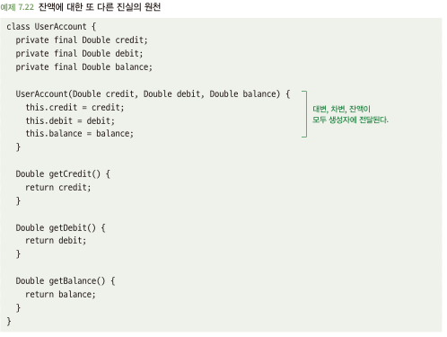
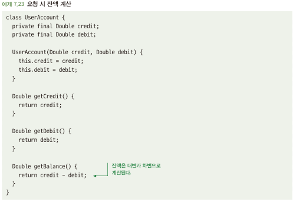

# 7.5 데이터에 대해 진실의 원천을 하나만 가져야 한다
- 데이터는 종종 두 가지 형태로 제공
  - 기본 데이터: 코드에 제공해야 할 데이터, 코드에 이 데이터를 알려주지 않고는 코드가 처리할 방법이 없음
  - 파생 데이터: 주어진 기본 데이터에 기반해서 코드가 계산할 수 있는 데이터
- 기본 데이터는 진실의 원천

## 7.5.1 또 다른 진실의 원천은 유효하지 않은 상태를 초래할 수 있다
- 진실의 원천으로 파생데이터를 활용할 경우 실제와 같지 않은 경우 발생\

## 7.5.2 해결책: 기본 데이터를 유일한 진실의 원천으로 사용하라
- 기본 데이터만 유일한 진실의 원천으로 사용하고, 파생 데이터는 호출마다 계산하자\

- 정의할 수 있는 데이터 모델과 이러한 데이터 모델이 논리적으로 잘못된 상태를 허용하는지 숙고하기
- 데이터 계산에 비용이 많이 드는 경우
  - 호출마다 하기엔 비용이 많이 든다면? 지연 계산 후 캐싱 처리
  - 대신 클래스 자체가 불변적이어야 함