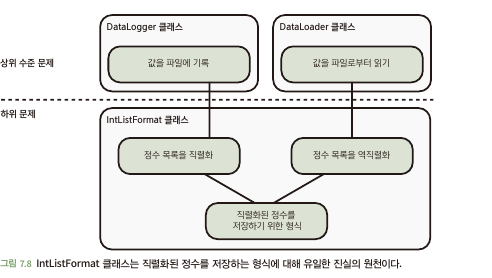

# 7.6 논리에 대한 진실의 원천을 하나만 가져야 한다
- 진실의 원천은 코드에 포함된 논리에도 적용
- 논리를 위한 진실의 원천 역시 단 하나만 존재하도록 하는 것이 중요

## 7.6.1 논리에 대한 진실의 원천이 여러 개 있으면 버그를 유발할 수 있다
- 논리에 대한 원천(규칙)이 다른 클래스에 존재한다면? 추후 문제 발생 가능성 존재
  - 하나의 클래스만 수정하면, 반대 클래스 수정이 안일어 날 시 문제 발생

## 7.6.2 해결책: 진실의 원천은 단 하나만 있어야 한다
- 하나의 클래스에서 진실의 원천에 대한 논리 로직이 존재해야함 -> 분산 X\

  