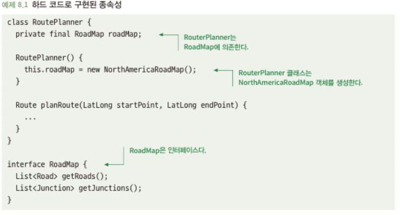
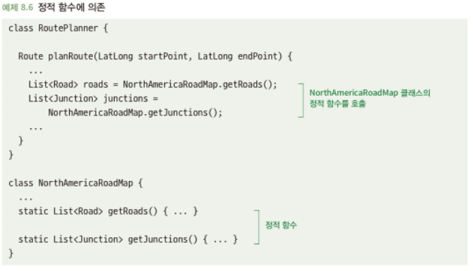

# 8.1 의존성 주입의 사용을 고려하라
- 일반적으로 클래스는 다른 클래스에 의존
- 높은 수준의 문제를 하위 문제로 나눠서 해결
- 하위수준 문제가 하나만 존재하는 건 아님 -> 하위 문제를 재구성할 수 있는 방식으로 코드 작성 필요

## 8.1.1 하드 코드화된 의존성은 문제가 될 수 있다
- 아래 코드의 RoutePlanner는 RoadMap의 하나의 구현체인 NorthAmericaRoadMap을 의존함\

- 이는 다음과 같은 문제점 발생
  - RoutePlanner가 NorthAmericaRoadMap에 대한 로직에만 활용
  - NorthAmericaRoadMap 생성자 값이 수정되면 RoutePlanner에도 수정이 들어가야 함

## 8.1.2 해결책: 의존성 주입을 사용하라
- 생성자 매개변수로 의존성 주입 -> 다른 로드맵도 활용 가능
- 인스턴스 생성 및 주입에 대해 복작해지는 단점 -> 팩토리 함수 or 의존성 프레임웍 활용

## 8.1.3 의존성 주입을 염두에 두고 코드를 설계하라
- 코드 작성 시, 의존성 주입을 사용할 수 있다는 점을 의식적으로 고려하는게 유요할 수 있음\
-> 의존성 주입을 사용하고 싶어도 불가능할 수도 있음\

  (?) 내용에서 해결책이 하나일 경우는 정적함수 써도 되지만 왠만하면 쓰지말라고 읽혀지는데 제대로 이해한게 맞을까?
