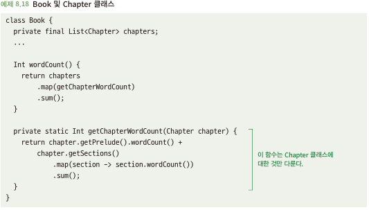
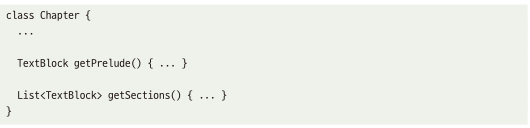
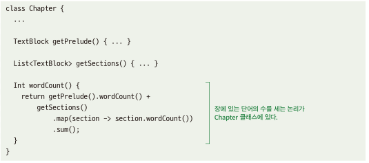

# 8.4 클래스는 자신의 기능에만 집중해야 한다
- 요구 사항이 변경되면 그 변경과 직접 관련된 코드만 수정 -> 모듈화의 핵심 목표 중 하나
- 위와 반대되는 상황은 하나의 개념이 여러 클래스에 분산되는 경우

## 8.4.1 다른 클래스와 지나치게 연관되어 있으면 문제가 될 수 있다
- 아래 코드에서는 getChapterWordCount()는 Chapter 클래스와 관련된 세부 사항이 Book에 하드 코딩되어 있음\

- Chapter에서 요약이라는 값이 추가가 되어 word값이 늘어나면? Book쪽에 문제를 인지 못할 확률이 높음

## 8.4.2 해결책: 자신의 기능에만 충실한 클래스를 만들라
- 한 가지 사항에 대한 변경 사항이 코드의 한 부분만 영향을 미치도록 하기\

- 요구 사항의 변경이 필요하면 해당 요구 사항과 직접 관련된 코드만 변경