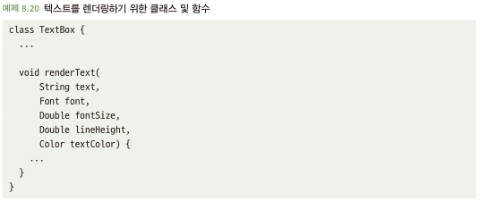
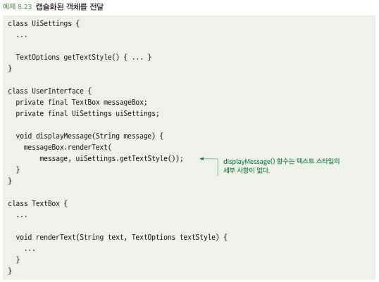

# 8.5 관련 있는 데이터는 함께 캡슐화하라
- 클래스를 통해 여러 가지를 함께 묶을 수 있음 -> 조심해야 하지만 이점이 있음
- 서로 다른 데이터가 서로 밀접하게 연관 되어 있어 항상 함께 움직이여야 함 -> 클래스로 그룹화

## 8.5.1 캡슐화되지 않은 데이터는 취급하기 어려울 수 있다
- 하기와 같이 text를 제외한 font~textColor까지의 매개변수를 나열하면? 호출하는 쪽에서 파라미터에 대해 세부적으로 알아야함\

## 8.5.2 해결책: 관련된 데이터는 객체 도는 클래스로 그룹화하라
- 관련 데이터끼리는 클래스로 묶어주자\
