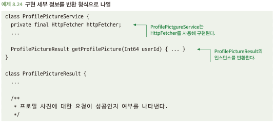
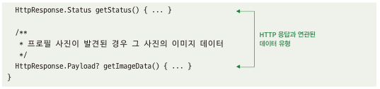
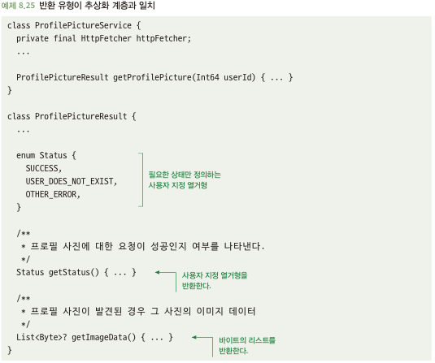

# 8.6 반환 유형에 구현 세부 정보가 유출되지 않도록 주의하라
- 간결한 추상화 계층을 가지려면? 각 계층의 구현 세부 정보가 노출되면 안됨
- 하위 계층의 대한 정보가 노출 될수록 유지보수가 어려워짐

## 8.6.1 반환 형식에 구현 세부 사항이 유출될 경우 문제가 될 수 있다
- 아래와 같은 코드는 반환 형식이 세부 구현과 밀접한 타입을 반환하고 있음\
\

- 호출하는 쪽에서는 반환 타입에 대한 Http 내 Status 및 Payload에 대한 지식을 알아야함 -> 이는 이미지 가져오는 프로토콜 변경 시, 소스 내부의 HttpResponse 객체를 전체 변경해야 할 수 있음

## 8.6.2 해결책: 추상화 계층에 적합한 유형을 반환하라
- 세부 구현이 아닌 추상화의 목적과 그에 맞는 유형을 반환해주자\

