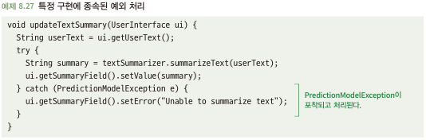
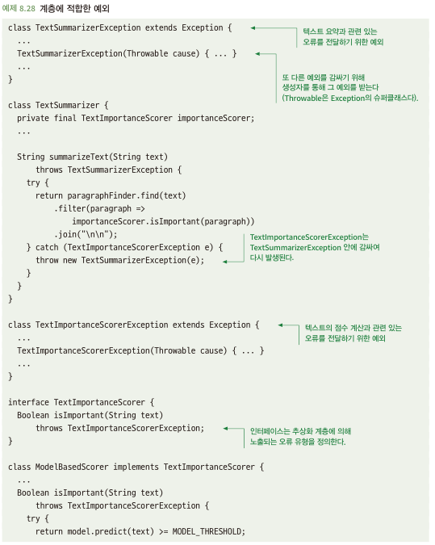
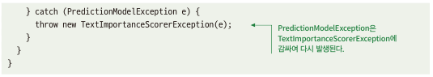

# 8.7 예외 처리 시 구현 세부 사항이 유출되지 않도록 주의하라
- 세부 구현과 연관성 있는 예외를 발생 시키면 추상화 의미 퇴색

## 8.7.1 예외 처리 시 구현 세부 사항이 유출되면 문제가 될 수 있다
- 비검사 예외는 위치나 시기, 코드가 어디에서 그 예외를 처리하는지에 대해 컴파일러가 강제 되지 않음
- 아래와 같이 세부 구현에서 발생하는 예외를 함수 호출하는 쪽에서 사용하게 만들면 -> 하위 클래스 교체시 다른 문제 야기 시킴\

## 8.7.2 해결책: 추상화 계츨에 적절한 예외를 만들라
- 각 계층은 추상화 계층을 반영하는 오류 유형만을 드러내는 것이 이상적
- 새 예외 유형을 정의하여 예외를 발생 해주자 -> 단점은 더 많은 코드가 추가됨\
\

