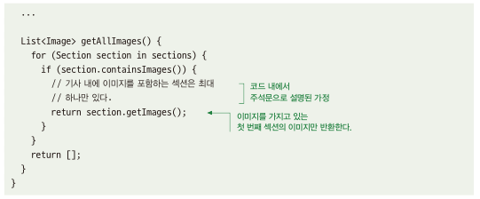

# 9.1 가정을 주의하라
- 코드 작성 시 가정을 하면 코드가 더 단순해지거나, 효율적일 수도 있음, But 코드가 더 취약해지고 안전하지 않을 수 있음

## 9.1.1 가정은 코드 재사용 시 버그를 초래할 수 있다
- 아래의 코드는 기사에서 이미지를 가져오는 코드임\

- 해당 코드에서는 속도 개선을 위해 이미지가 한 세션에만 있을꺼라는 가정이 들어감 -> 이는 잘못된 가정일 확률이 높기에 함수를 활용하는 쪽에 문제 야기시킴\

## 9.1.2 해결책: 불필요한 가정을 피하라
- 이미지 세션이 하나만 있다는 가정에는 코드 재사용하거나 요구사항 변경되면 버그 발생 가능성이 큼
- 코드에 가정이 들어가면 취약성의 측면에서도 관련 비용이 수반
- 섣부른 최적화 방지: 섣부른 코드 최적화로 미미한 성능 효과 보단 성능 향상으로 확실한 이득을 보는게 명백해 질때 하는게 좋음
