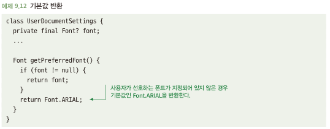
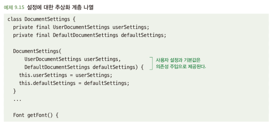
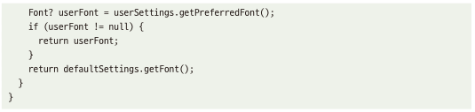

# 9.3 기본 반환값을 적절하게 사용하라
- 필요한 전체 값을 다 받는거 보다 기본값이 있으면 호출하는 쪽이 작업이 쉬워짐
- 기본값을 제공하려면 두가지 가정이 필요
  - 어떤 기본값이 합리적인지
  - 더 상위 계층의 코드는 기본 값을 받든지 명시적으로 설정된 값을 받든지 상관하지 않는다
- 이런 가정은 상위 수준의 코드에서 하는 것이 더 좋음 -> 낮은 쪽에서 사용하면 모든 용도에 적합한 기본 값 선택 어려움

## 9.3.1 낮은 층위의 코드의 기본 반환값은 재사용성을 해칠 수 있다
- 일반적으로 아래와 같은 낮은 수준의 코드에서 기본 값 정의\

- 위와 같은 코드는 기본 값과 관련된 요구사항에 대응하기 어려움
  - 케이스별 기본 값이 다를 경우
- 낮은 계층에서 기본 값이 결정될 때, 활용되는 상위 계층에 전역적으로 영향을 미침
- 위와 같은 경우, 검색과 정의를 같이 묶여기에 좋은 방법은 아님

## 9.3.2 해결책: 상위 수준의 코드에서 기본값을 제공하라
- 사용자가 제공한 값이 없을 때 널값 반환 -> 기본 값 제공은 사용자 설정과는 별개 문제\
\

- 의존성 주입을 통해 기본 값 제공 -> 코드의 재사용성과 적응성 보장