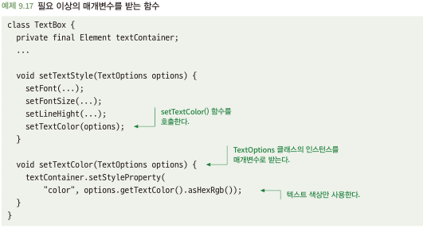
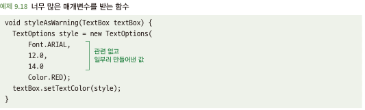
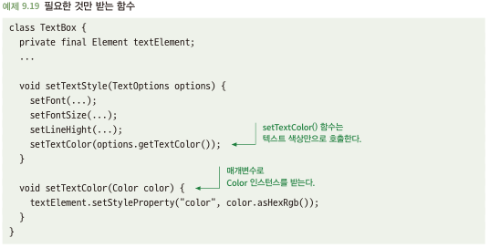

# 9.4 함수의 매개변수를 주목하라
- 함수가 한두 가지 정보만 필요로 할 때는 개체나 클래스의 인스턴스 매개변수로 사용하는 것은 코드의 재사용성을 해칠 수 있음

## 9.4.1 필요 이상으로 매개변수를 받는 함수는 재사용하기 어려울 수 있다
- 아래 코드의 setTextColor는 텍스트 색상만 활용하지만 객체 전체를 매개변수로 받음\

- 특정한 경우에 대해 값 변경이 필요하면? 인스턴스 생성 및 함수 호출에 대해 세부 사항 파악 필요\

## 9.4.2 해결책: 함수는 필요한 것만 매개변수로 받도록 하라
- 일반적으로 함수가 필요한 것만 받도록 하면 코드는 재사용성이 향상되고 이해하기가 쉬워짐\

- 클래스 10개 항목 중 8개 사용이면 클래스 넘겨주는게 합리적임
- 모든 상황에 적용되는 한 가지 정답은 없음