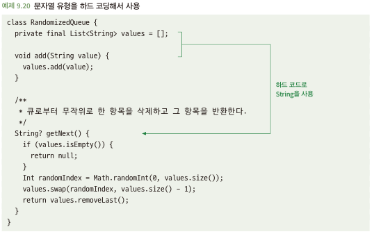
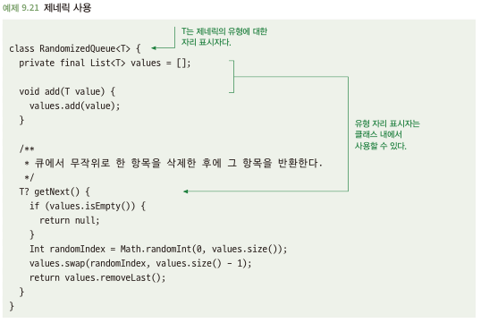

# 9.5 제네릭의 사용을 고려하라
- 제네릭 및 템플릿을 통해 같은 문제 해결을 유형별로 나눌 필요가 없음
- 다른 클래스를 참조하는 코드를 작성하지만 그 클래스가 어떤 클래스인지 신경쓰지 않으면 제네릭 고려

## 9.5.1 특정 유형에 의존하면 일반화를 제한한다
- 아래 코드는 String에 대한 유형을 정의했기에 String 데이터 유형만 활용 가능 -> 일반화 제한\

## 9.5.2 해결책: 제네릭을 사용하라
- 제네릭을 활용하면 코드 일반화하는 것이 아주 쉬움\

- 높은 수준의 문제를 하위 문제로 세분화하다 보면 다양한 사례에 적용할 수 있는 근본적인 문제를 접함
- 하위 문제 해결에 모든 데이터 유형에 쉽게 적용될 수 있게 하는게 좋음